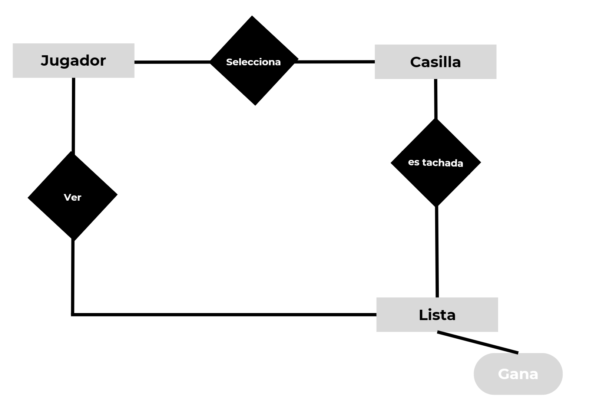

# 1.2  Práctica de lógica computacional #
Paloma Pérez de Madrid

## Elegir el problema a resolver
Juego elegido: 3 en raya

## Describir reglas del sistema en el lenguaje natural
- El tablero comienza vacío, hay 6 huecos.
- Primero se elige el jugador que va a ir primero.
- El jugador puede rellenar la casilla que quiera, siempre y cuando esté vacía.
- La distribución de las casillas serán las siguientes:
&nbsp;&nbsp;&nbsp;&nbsp;&nbsp;&nbsp;&nbsp;&nbsp;&nbsp;&nbsp;&nbsp;&nbsp;&nbsp;&nbsp;&nbsp;&nbsp;&nbsp;&nbsp;&nbsp;&nbsp;&nbsp;&nbsp;                           | 1 |2 | 3 |
 &nbsp;&nbsp;&nbsp;&nbsp;&nbsp;&nbsp;&nbsp;&nbsp;&nbsp;&nbsp;&nbsp;&nbsp;&nbsp;&nbsp;&nbsp;&nbsp;&nbsp;&nbsp;&nbsp;&nbsp;&nbsp;&nbsp;                            |4 | 5 | 6 |
  &nbsp;&nbsp;&nbsp;&nbsp;&nbsp;&nbsp;&nbsp;&nbsp;&nbsp;&nbsp;&nbsp;&nbsp;&nbsp;&nbsp;&nbsp;&nbsp;&nbsp;&nbsp;&nbsp;&nbsp;&nbsp;&nbsp;                          | 7 | 6 | 9 |
- El objetivo es tener 3 casillas rellenadas alineadas o en diagonal.
    (1-2-3/4-5-6/-7-8-9/1-5-9/7-5-3)
- El objetivo es tener 3 casillas rellenadas alineadas o en diagonal.
    (1-2-3/4-5-6/-7-8-9/1-5-9/7-5-3)

## Como Jugar
1. Inicializa el juego
    `inicializar().`
2. Elige el jugador que va a ir primero
3. El primer jugador debe elegir casilla
    `jugador1(1)` El jugador 1 ha tachado la casilla 1
4. Repite el juego hasta que todas las casillas estén rellenadas o alguien haya ganado
5. Puedes consultar las casillas que ya tienen marcadas los jugadores
    jugador 1: `leer_lista1(L)`
    jugador 2: `leer_lista2(S)`

## Ejemplo de juego:
?- *inicializar()*.
true.

?- *jugador1(1).*
true.

?- *jugador2(4).*
true.

?- *jugador1(2).*
true.

?- *jugador2(2).*  // rellenar una casilla que el jugador 1 ha marcado previamente
false.

?- *jugador2(5).*
true.

?- *jugador1(2).*  //Intenta rellenar una casilla marcada por sí mismo anteriormente
false.

?- *jugador1(3).* Rellena [1,2,3] --> Ha ganado
¡Has ganado!
true.

Ver las casillas marcadas:
?- *leer_lista1(L).*
L = [3, 2, 1].

?- *leer_lista2(L).*
L = [5, 4].

## Procedimiento del programa
- jugador1(4) --> El jugador 1 rellena la casilla 4, dicha información se almacena en la lista 1
- jugador2(5) --> El jugador 1 rellena la casilla 5, dicha información se almacena en la lista 2
Jugar hasta que salga "Has ganado" o no deje tachar más casillas  

### Retract y assert
Para ello he utilizado las siguientes funciones: 
- `Retract`
    + retract(lista1(Lista1)) --> obtiene la lista actual (Lista1) que está guardada en el hecho lista1
- `Retractall`
    + retractall(lista2(_)), --> quiero descartar la posibilidad de que el mismo hecho lo tenga reflejado el intérprete varias veces
- `Assert`
    + assert(lista1([N|Lista1])) --> Luego de obtener Lista1, añadimos el nuevo movimiento (N) al principio

### Subset
Para verificar si una Lista (Casillas tachadas por el jugador) hace 3 en raya debemos confirmar si los elementos de dicha lista se encuentra en algún conjuntos ganador (conjuntos de 3 casillas que forman una diagonal o se alinean). Para ello utilizamos:

 `subset(Conjunto, Lista)` 
 
 "verifica si todos los elementos de un conjunto están también en otro conjunto" 

### Diagrama 

    